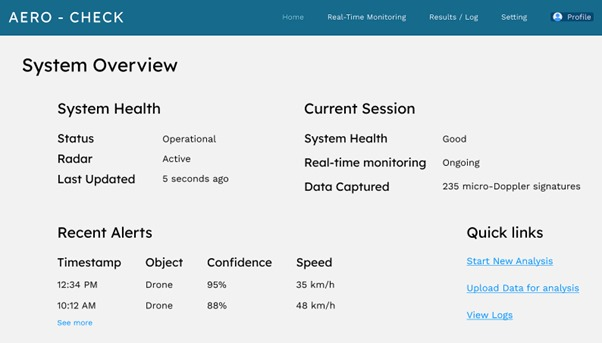
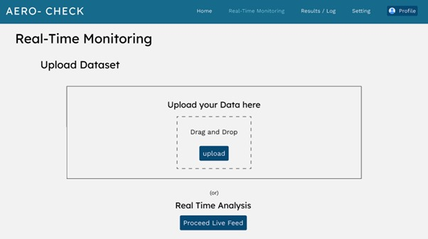
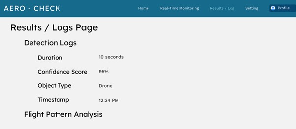

# 🚀 AeroCheck-Enhanced Micro-Doppler Detection System  
                        **Precision Redefined in Drone Detection**

## 🛠️ Project Overview  
AeroCheck is a cutting-edge solution designed to accurately classify drones from birds and clutter by analyzing micro-Doppler radar signatures. Utilizing Transformer-based deep learning models, this system delivers high-precision, real-time results for security and surveillance applications.

## 🎯 Key Features  
- **Transformer-Based Classification**: Employs Transformer models to analyze temporal patterns in micro-Doppler signatures for drone detection.
- **Real-Time Detection**: Processes micro-Doppler data in real-time, ensuring minimal latency for immediate classification.
- **High Accuracy**: Achieves over 95% accuracy in distinguishing drones from birds and clutter. 
- **Scalable & Portable**: Designed for both urban and rural surveillance, with low power consumption.

## 🔍 Introduction  
As drones become increasingly common, they pose both opportunities and security risks. AeroCheck addresses these concerns by analyzing micro-Doppler radar signatures to differentiate between drones and other objects like birds, in real-time.

This system integrates Transformer-based deep learning to identify unique temporal features in radar data, providing enhanced classification accuracy. The current prototype focuses solely on Transformer models to demonstrate the feasibility of real-time micro-Doppler signature analysis.

## 💡 Technologies Used  
- **Python**: Core programming language for implementing algorithms and data handling.
- **PyTorch**: Framework used for developing and training Transformer models.
- **NumPy & SciPy**: For scientific computing and signal processing tasks.
- **Matplotlib & Seaborn**: Libraries for visualizing radar data and classification results.
- **Radar Signal Processing**: Custom algorithms for handling and processing micro-Doppler radar data.

## 🏗️ System Architecture  
Here’s the system flow for the Transformer-based AeroCheck prototype:

| Radar Data | → | Preprocessing Stage | → | Transformer Model | → | Classification Results |  

- **Radar Data Collection**: Captures micro-Doppler signatures from moving objects.  
- **Preprocessing Stage**: Filters out noise and standardizes radar data for analysis.  
- **Transformer Model**: Analyzes time-frequency patterns to identify key features for classification.  
- **Classification Stage**: Outputs final classification results into categories (Drone, Bird, Clutter).

## 📖 Usage Guide  
Once the project is installed, follow these steps to use the AeroCheck prototype:

- **Data Input**: Upload radar data into the `/data` directory for analysis.  
- **Real-Time Analysis**: Use real-time radar input for live classification of micro-Doppler signatures.  
- **Result Output**: The classification result (Drone, Bird, Clutter) will be displayed in the console or logged to a file.  
- **Visualization**: Use the `visualize.py` script to generate plots of processed radar data and classification outcomes.

## 🌟 Unique Selling Proposition (USP)  
AeroCheck leverages a Transformer-based approach for analyzing radar data, reducing false positives and enhancing precision in distinguishing between drones and other objects, especially in complex environments.

## 📊 Statistical Impact & Feasibility  
- **Accuracy**: Achieves over 95% classification accuracy in test environments.   
- **Real-Time Processing**: Minimal latency for immediate detection and response.  
- **Scalable**: Can be adapted for various surveillance environments (urban, rural).  
- **Cost-Effective**: Low power consumption and modest hardware requirements.

## 🤝 Contributing  
We welcome contributions to AeroCheck! If you're interested in enhancing the system or fixing issues, follow these steps:  

1. Fork the repository.  
2. Create a new branch.  
3. Make your changes.  
4. Submit a pull request.  

For significant changes, please open an issue to discuss the proposed modifications.

## 📜 License  
This project is licensed under the MIT License – see the [LICENSE](LICENSE) file for details.

